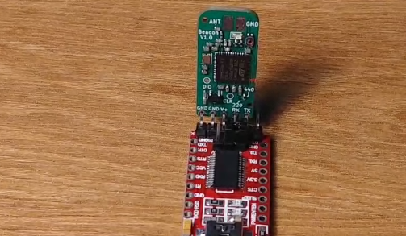

# rocketbeacon
Configurable sub-GHz radio beacon for amateur rocketry.

**Warning: make sure to comply with your local RF regulations. Some frequency bands require an amateur radio license, others have power or duty cycle limitations.**

## Hardware
The hardware is designed in KiCad for assembly with JLCPCB. Two versions of the RF front end are available, one optimized for the 220 MHz band and one for the 440 MHz band.

The hardware features:

* STM32WLE5 wireless microcontroller
* Max 22 dBm output power
* CR2032 battery holder
* Can be powered externally by 3.3-5V

## Battery selection and life
**Warning: the beacon doesn't have reverse polarity protection, always double check the battery polarity!** If powered by an external battery (e.g. 1s lipo), connect to the V+ and GND pins. 

CR2032 batteries can't supply much current. When using CR2032 batteries, transmit powers above 16 dBm are not recommended without proper testing. When the voltage drops below 1.8V, the module restarts. An initial delay of a few seconds is thus recommended to allow CR2032 batteries to "recover" after a reset.

To give an idea of the battery life: 3x200 ms beeps at -9, 2, 14 dBm at 4 second intervals achieved 20 hours of battery life with the CR2032. 

Using LiPo batteries, transmit powers up to 22 dBm can be used without issues.

## Assembly
The assembled PCB can be ordered by uploading the files from `hardware\beacon\jlcpcb` to JLCPCB. These files are also available in releases as a zip file. `GERBER-beacon.zip` contains the PCB files. For the pick-and-place centroid file, pick either `CPL-beacon-no-pinheader.csv` (cheaper and more compact) or `CPL-beacon-with-pinheader.csv` (assembled with pinheader). `BOM-beacon-v1.0-440MHz.csv` or `BOM-beacon-v1.0-440MHz.csv` are the BOMs for each frequency version (pick one). Make sure visually that all components (except the 220/440 indicator resistor) are populated. If the default STM32WLE5CBU6 is unavailable, the STM32WLE5CCU6 can be selected instead (works with the same firmware).

Use the following settings when ordering:

* Layers=2
* Thickness=1.6
* Vias=Tented
* Remove order number=Specify a location
* PCBA type=Economic
* Assembly side=Top side
* Tooling holes = Added by Customer

Other than the assembled PCB, an antenna is required. For a basic quarter wave copper antenna, you can use `length = 0.95 * 0.25 * speed of light / frequency`, where 0.95 is the velocity factor of copper. E.g.

* For 433 MHz, use a 165mm
* For 220 MHz band, Use 324mm

If powered by a button cell battery, solder on a [MY-2032-12](https://www.lcsc.com/product-detail/Battery-Connectors_MYOUNG-MY-2032-12_C964833.html) battery connector. Other similar CR2032 holders work as well, but may require trimming the solder leads to fit the footprint. Melt a little solder on the negative battery terminal before soldering on the battery holder to ensure proper electrical contact.

## Compile and program
The firmware can be modified and compiled with [STM32CubeIDE](https://www.st.com/en/development-tools/stm32cubeide.html).

The main code is located in `Firmware\Core\Src\main.c`. There are three main functions used to generate RF signals:

* `FSKBeep(int8_t powerdBm, uint32_t toneHz, uint32_t lengthMs)`: Synthesize a FSK sequence of alternating 1s and 0s. With a FM receiver, it sounds like a constant audio tone at `toneHz`.
* `CWBeep(int8_t powerdBm, uint32_t lengthMs)`: Generate a continuous wave tone. E.g. for morse code

Note that the `powerdBm` value can range from -9 to 22 dBm. `HAL_Delay(uint32_t millis)` can be used as delay.

Additionally, `play_morse_word(uint8_t* letters, uint8_t len, bool use_cw)` can be used to send an array of letters as morse (either FM or CW).

Programming the firmware can be done with [STM32CubeProg](https://www.st.com/en/development-tools/stm32cubeprog.html) and a cheap UART to USB dongle (If you don't have one, search "FTDI adaptor" and get one of the red dongles with 6 pins)

* Disconnect power
* Hold down the button
* Set UART adaptor to output 5V power with the jumper, though 3.3V should work as well.
* Connect the UART adaptor to the beacon (make sure Rx->Tx, Tx->Rx, GND->GND and VCC->V+). If unsoldered, hold them at an angle to ensure proper contact as shown below.
* LED should be continuously ON, indicating it has entered bootloader mode.
* In STM32CubeProg, select the UART option and port. Then connect to the MCU.
* In the Erasing & Programming tab, pick the right firmware `Firmware\Debug\rocketbeacon.elf`, and program
* Cycle power to execute the code.

## Reception and tuning
Tune your radio to the programmed frequency. Without calibration, the frequency has a tolerance of roughly +/- 5 KHz in the 70 cm band.

## Configuration
TODO: Make a little UART configuration interface to set frequency, callsign etc.